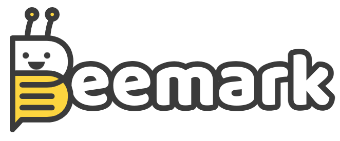

# Beemark Web App

Beemark is a web application to manage bookmarks in a simple way.

Made using:

- NextJS(TS) : Fullstack framework based on ReactJS
- Chakra UI : UI framework with reusable components
- Axios : Extensible HTTP client

## 🐝 Features

- [x] Simple web interface
- [x] Responsive
- [x] Bookmarks management
- [x] JWT based authentication

## 🗺️ Roadmap

- [ ] Dark mode
- [ ] Bookmark pagination
- [ ] Avatar support

## 📱 Mobile version

#### Login


#### List and search bookmarks


#### Create a bookmark


## 💻 Desktop version


## 📦 Dependencies

- NodeJS v19
- NPM v8

## 📦 Installation

To install project dependencies, execute command:

```bash
$ npm install
```

Then, set required environment variables creating a `.env` file. You can just copy `.env.example` by using:
```bash
$ cp .env.example .env
```
and modifies it.


## 🖥 Execution

#### Development server

To execute development server, execute command:

```bash
$ npm run dev
```

#### Conventional server

To run built-in server, application pre-compiling is required. First run:

```bash
$ npm run build
```

Then just run built-in server using command:

```bash
$ npm run start
```
